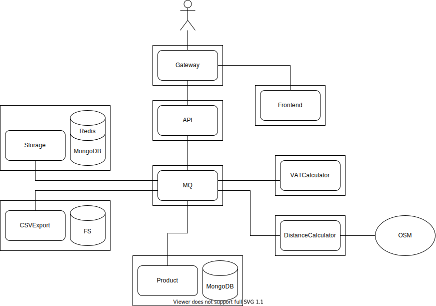
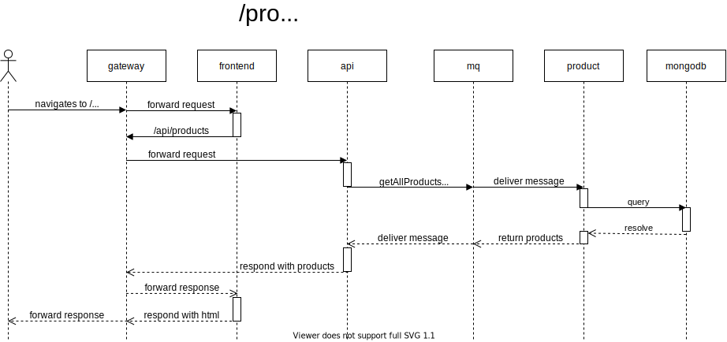

# Diagrams

## Architecture Diagram

Arrangements of the micro services and the connections to other components they
can interact with.

Edit on [draw.io](https://app.diagrams.net/#Hhtw-kbe-jneidel%2Fplanning%2Fdrawio%2FArchitecture.drawio).

## Sequence Diagram

The flow of one call through going through the entire width of the system.

Edit on [draw.io](https://app.diagrams.net/#Hhtw-kbe-jneidel%2Fplanning%2Fdrawio%2FSequence.drawio).

## Entity Relationship Diagram

Database objects and what architectural components they live in.

Edit on [draw.io](https://app.diagrams.net/?client=1#Hhtw-kbe-jneidel%2Fplanning%2Fdrawio%2FEntity%20Relationship.drawio).
